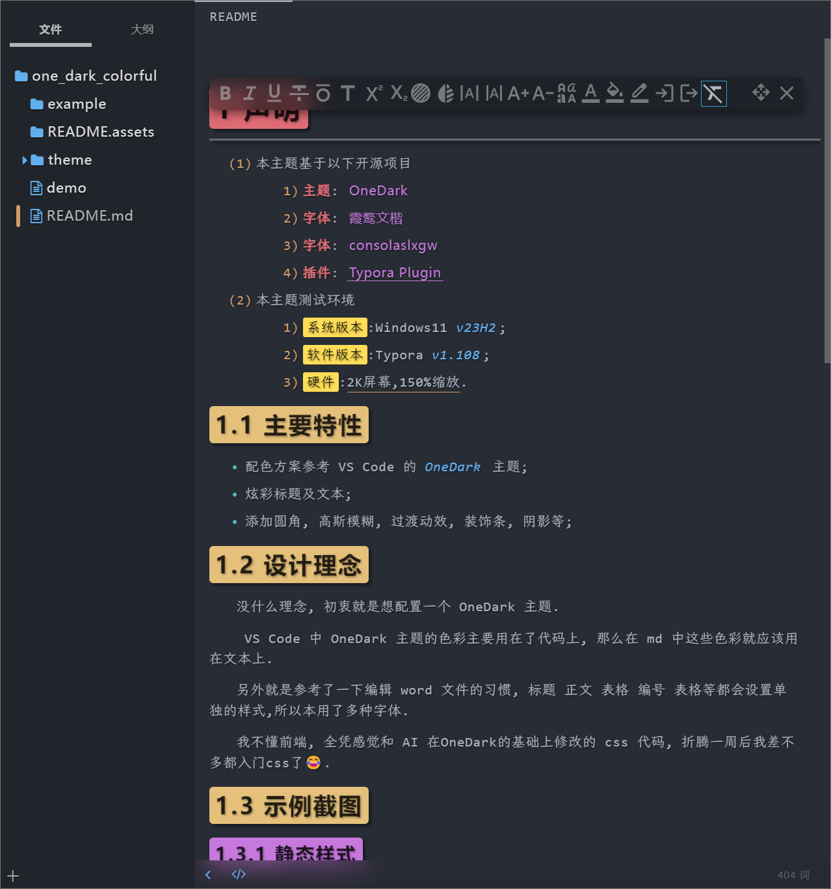
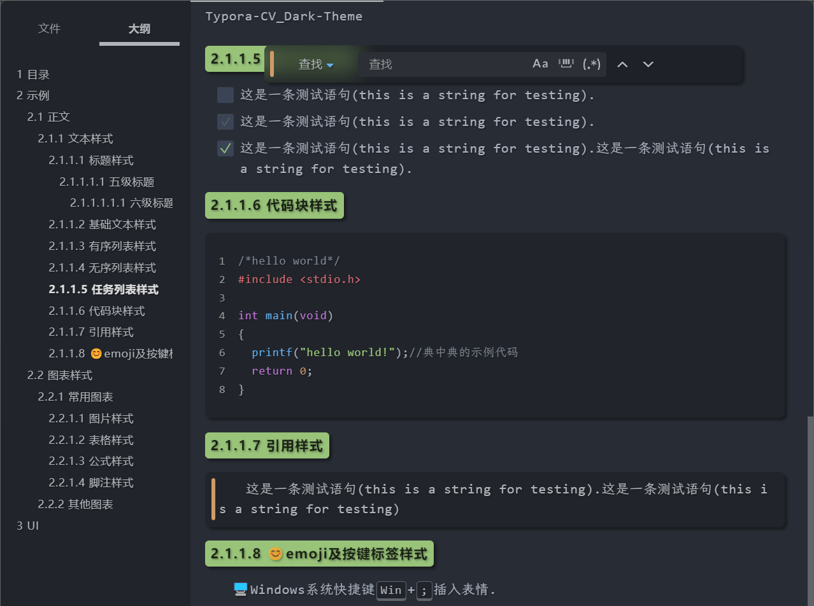
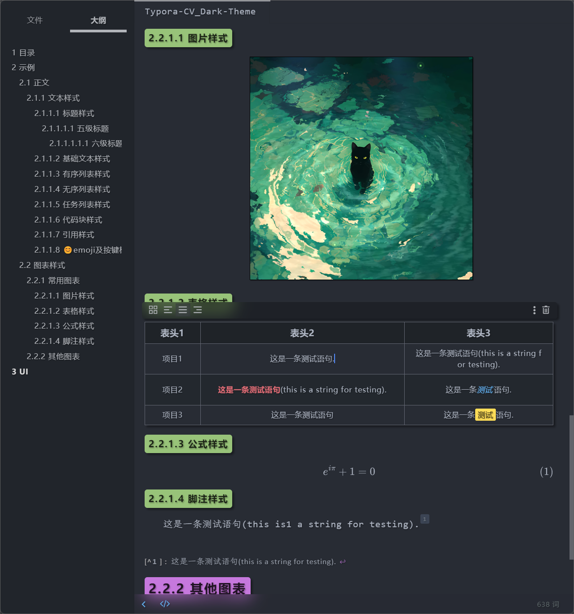

# 声明

1. 本主题基于以下开源项目
   1. **主题**: [OneDark ](https://github.com/sweatran/typora-onedark-theme/tree/master )

   2. **字体**: [霞鹜文楷](https://github.com/lxgw/LxgwWenKai)

   3. **字体**: [consolaslxgw](https://github.com/lxgw/LxgwWenKai)

   4. **插件**: [Typora Plugin](https://github.com/obgnail/typora_plugin)

2. 本主题测试环境
   1. ==系统版本==:Windows11 *v23H2*;
   2. ==软件版本==:Typora *v1.108*;
   3. ==硬件==:<u>2K屏幕,150%缩放</u>.

## 主要特性

- 配色方案参考 VS Code 的 *OneDark* 主题;
- 炫彩标题及文本;
- 添加圆角, 高斯模糊, 过渡动效, 装饰条, 阴影等;

## 设计理念

没什么理念, 初衷就是想配置一个 OneDark 主题.

 VS Code 中 OneDark 主题的色彩主要用在了代码上, 那么在 md 中这些色彩就应该用在文本上.

另外就是参考了一下编辑 word 文件的习惯, 标题 正文 表格 编号 表格等都会设置单独的样式,所以本用了多种字体.

我不懂前端, 全凭感觉和 AI 在OneDark的基础上修改的 css 代码, 折腾一周后我差不多都入门css了😂.

## 示例截图

### 静态样式

### 动效

## 安装

1. 下载;
2. 解压下载的压缩文件;
3. 可打开 `📁./example` 文件夹下的 `📄example.pdf` 预览主题, 也可在完成安装后打开 `📁./example` 文件夹下的 `📄example.md` 预览主题;
4. 双击安装 `📁./fonts` 文件夹下的字体文件;
5. 将 `📁./theme` 文件夹下的 `📄one_dark_colorful.css` 文件复制到 Typora 主题文件夹下;
6. 重启 Typora, 选择 ==OneDarkColorful== 主题;

## To-Do

- [ ] 图表类未适配完成;
- [ ] 部分 UI 效果未完成;
- [ ] Linux, MacOS 未测试适配;

---

如果你喜欢本主题,就给个⭐吧.

