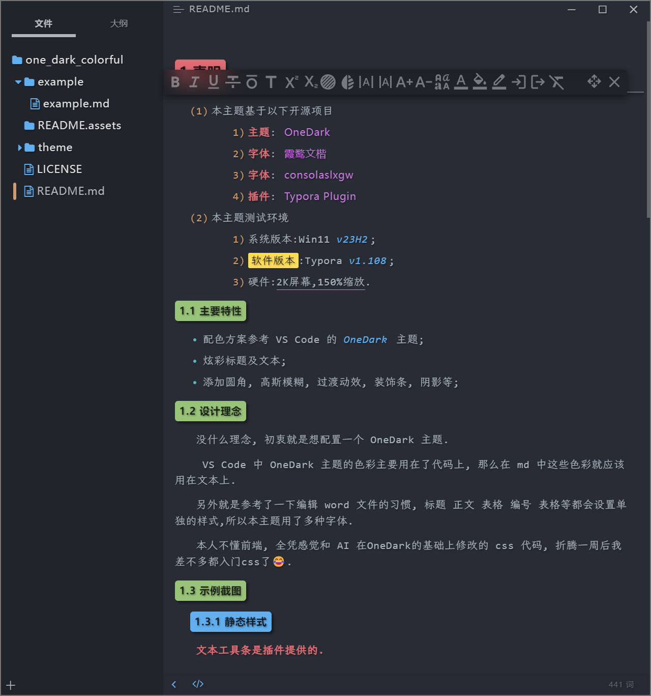
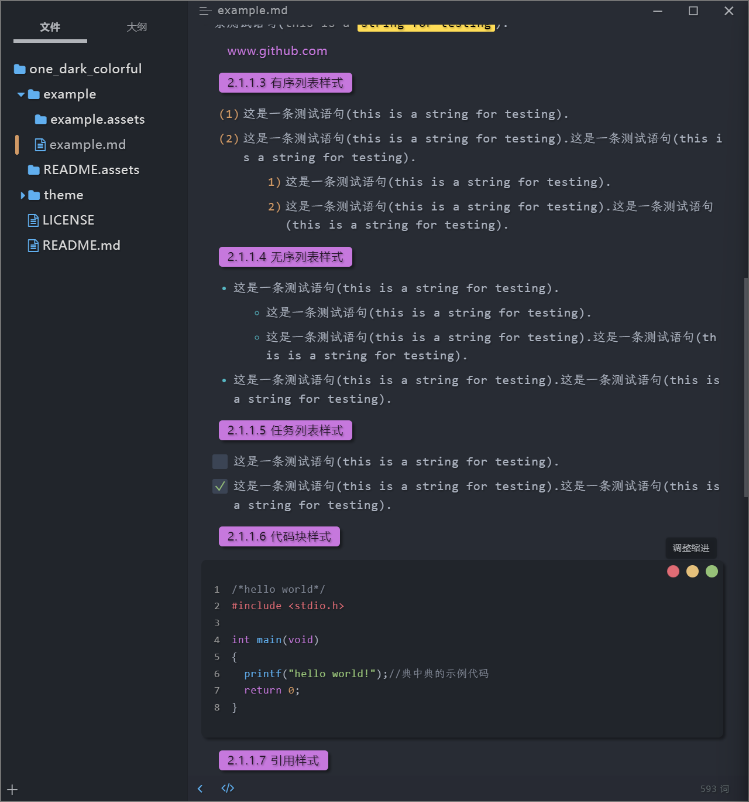
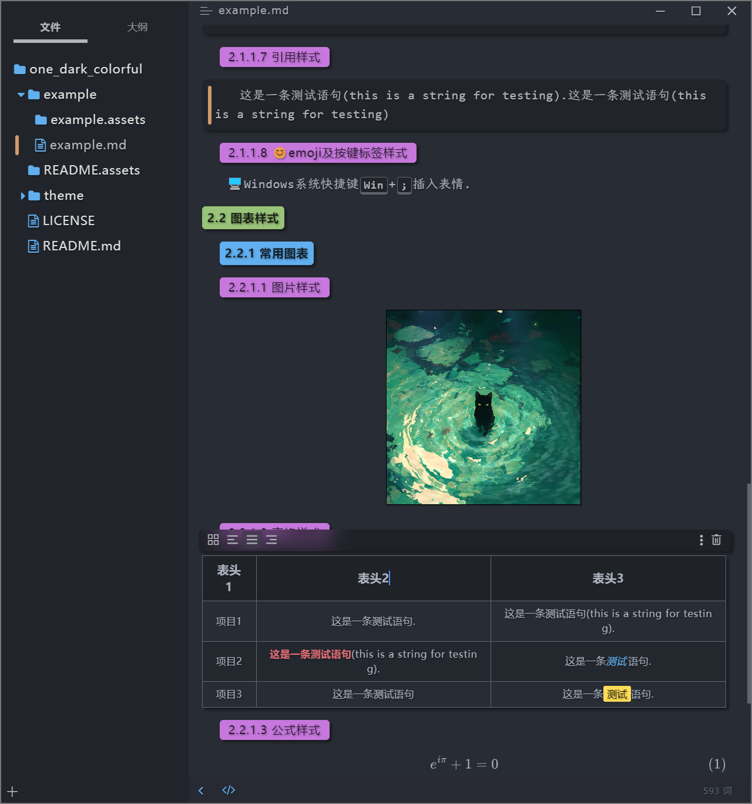

# 声明

1. 本主题基于以下开源项目
   
    1. **主题**: [OneDark ](https://github.com/sweatran/typora-onedark-theme/tree/master )
      
    2. **字体**: [霞鹜文楷](https://github.com/lxgw/LxgwWenKai)
      
    3. **字体**: [consolaslxgw](https://github.com/lxgw/LxgwWenKai)
      
    4. **插件**: [Typora Plugin](https://github.com/obgnail/typora_plugin)

2. 本主题测试环境
   
    1. 系统版本:Win11 *v23H2*;
    2. <mark>软件版本</mark>:Typora *v1.108*;
    3. 硬件:<u>2K屏幕,150%缩放</u>.

## 主要特性

- 配色方案参考 VS Code 的 *OneDark* 主题;
- 炫彩标题及文本;
- 添加圆角, 高斯模糊, 过渡动效, 装饰条, 阴影等;

## 设计理念

没什么理念, 初衷就是想配置一个 OneDark 主题.

 VS Code 中 OneDark 主题的色彩主要用在了代码上, 那么在 md 中这些色彩就应该用在文本上.

另外就是参考了一下编辑 word 文件的习惯, 标题 正文 表格 编号 表格等都会设置单独的样式,所以本主题用了多种字体.

本人不懂前端, 全凭感觉和 AI 在OneDark的基础上修改的 css 代码, 折腾一周后我差不多都入门css了😂.

## 示例截图

### 静态样式

**文本工具条是插件提供的.**

## 安装

1. 下载压缩包(也可直接下载`📁./theme` 文件夹下的 `📄one_dark_colorful.css` 文件,然后自行下载`📁.theme/fonts` 文件夹下的字体).
2. 解压下载的压缩文件;
3. 双击安装 `📁.theme/fonts` 文件夹下的字体文件;
4. 将 `📁./theme` 文件夹下的 `📄one_dark_colorful.css` 文件复制到 Typora 主题文件夹下;
5. 重启 Typora, 选择 OneDarkColorful主题;

## To-Do

- [ ] 图表类未适配完成;
- [ ] 部分 UI 效果未完成;
- [ ] Linux, MacOS 未测试适配;

---

如果你喜欢本主题,就给个⭐吧.
